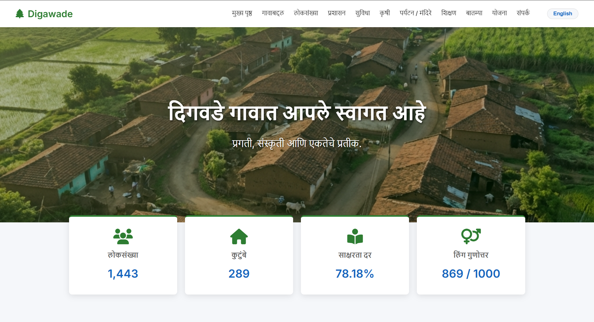

# 🌿 Digawade Village Website

**Live Website:**  
👉 https://digawade-website-version-30.vercel.app/index.html

This project is a simple and informative website created to represent **Digawade village** online.  
It provides essential information about the village including population, facilities, governance, education, agriculture, and local updates.

The goal of this project is to bring village information to the digital world in a clean and accessible way.

---

## 📸 Website Preview

---

## 🏡 About Digawade

Digawade is a village that reflects unity, culture, and rural development.  
This website acts as a digital information hub for residents and visitors.

The platform includes key village statistics and structured sections for easy navigation.

---

## ✨ Features

✔ Clean and simple UI  
✔ Marathi + English friendly layout  
✔ Village statistics overview  
✔ Information about governance and facilities  
✔ Agriculture and education details  
✔ News and government schemes section  
✔ Fully static website (no backend required)  
✔ Fast deployment using Vercel

---

## 📊 Key Information Shown

- Population: 1,443  
- Families: 289  
- Literacy Rate: 78.18%  
- Gender Ratio: 869 / 1000  

---

## 🛠️ Built With

- HTML  
- CSS  
- Static Website Hosting (Vercel)

---

## 🎯 Purpose of This Project

This project was built to:

- Digitally represent the village  
- Provide easy access to public information  
- Serve as a community information portal  
- Showcase web development skills through a real-world project

---

## 🚀 Deployment

The website is deployed and publicly accessible here:

👉 https://digawade-website-version-30.vercel.app/index.html

---

## 👤 Author

**Pramod Shinde**  
Cybersecurity Learner | Developer  
Built as a community-focused project.

---

## ⭐ Support

If you like this project, consider giving it a star ⭐  
It motivates further development for community-focused tech projects.
